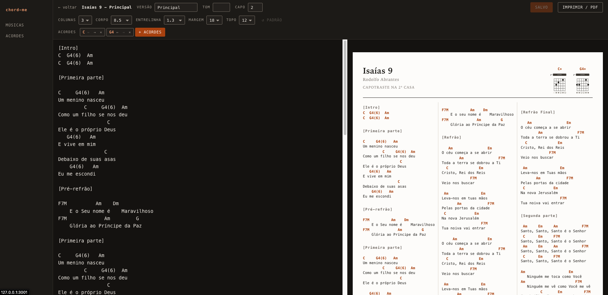
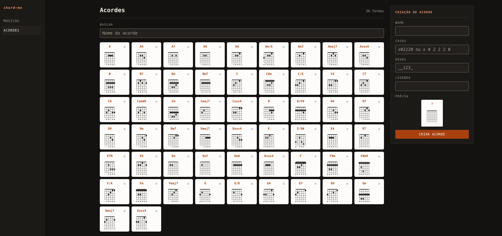

# chord-me

Local, login-free chord sheet manager. A small app that stores a reusable chord catalog, 
songs with multiple versions, and per-version print formatting — while keeping the same printed output.

Personal, single-user, never hosted.

## Stack

React 18 + Vite client, Express + better-sqlite3 server, TypeScript throughout, Vitest
for tests.

## Run

```bash
npm install
npm run dev
```

Open the URL Vite prints (`http://127.0.0.1:5173`). The API runs on
`http://127.0.0.1:3001`; the dev server proxies `/api` to it. Migrations apply and the
chord catalog seeds itself automatically on first run — no setup step beyond `npm install`.

```bash
npm test      # Vitest: parsing, diagram geometry, fret validation, migrations
npm run build # Type-check + build the client
npm start     # Serve the built client and the API from one process
```

## Data

Everything lives in `data/chord-me.db`, a single SQLite file (gitignored). Back up the
library by copying that file. Delete it and restart for a fresh, empty library with the
starter chord catalog reseeded.

## Print

The on-screen preview on a version's page **is** the printed page — same DOM, no
separate render path. Use the "Imprimir / PDF" button or `Cmd/Ctrl+P`. See
`specs/001-chord-sheet-mvp/contracts/print-contract.md` for the exact contract, and
`formatador-cifra.html` (kept at the repo root) as the visual reference baseline.

## Screenshots

**Editor de versão** — letra e cifra à esquerda, preview de impressão ao vivo à direita
(mesma página que sai na hora do `Imprimir / PDF`), com controles de colunas, corpo,
entrelinha, margem, capotraste e acordes usados na versão.



**Catálogo de acordes** — biblioteca de diagramas reutilizáveis (56 formas no exemplo),
com busca por nome e um formulário lateral pra criar acordes novos a partir das casas e
dedos.



## Structure

Client pages (`src/client/pages/`):

- `LibraryPage` — song list, entry point.
- `SongPage` — a song's versions.
- `VersionPage` — the editor + printable sheet for one version.
- `ChordsPage` — the reusable chord catalog.

Server routes (`src/server/routes/`): `songs.ts`, `versions.ts`, `chords.ts` — REST API
backing the pages above, over the SQLite file in `data/`.

## Project docs

Full spec, plan, data model, and API contracts: `specs/001-chord-sheet-mvp/` (MVP) and
`specs/002-ui-redesign/` (later UI redesign — side rail nav, chord picker popover,
stacked sheet head).
